# BigQuery extension for agentic VS Code based IDEs
**DISTINCT** makes it easy to work with **BigQuery** in agentic VS Code based IDEs. It provides tools for querying, exploring the data, and giving the AI agent controlled access to the BigQuery.

## What is DISTINCT?
**The extension does two things:**

- Makes it easy to explore your tables, run queries, view the results—just like the BigQuery Console, but better.
- Let's you give the Cursor/VS Code agent access to selected tables, and manage what context it has about the data.

Read more about the extension and us on our website: [distinct.sh](https://distinct.sh/)

### About us
We are two data scientists in Stockholm, Sweden, working in gaming and banking who also build some nice data tools. Please reach out on LinkedIn if you have feedback.

**Leo Enge** | [My LinkedIn](https://www.linkedin.com/in/leo-enge-52608a78/)

**Christoffer Ejemyr** | [My LinkedIn](https://www.linkedin.com/in/christoffer-ejemyr/)

---

# Features

## AI Access to BigQuery

### An extensive MCP for BigQuery
The extension automatically installs an MCP that Cursor can use for querying your data and effectively searching content, as well as skills tailored to data work.
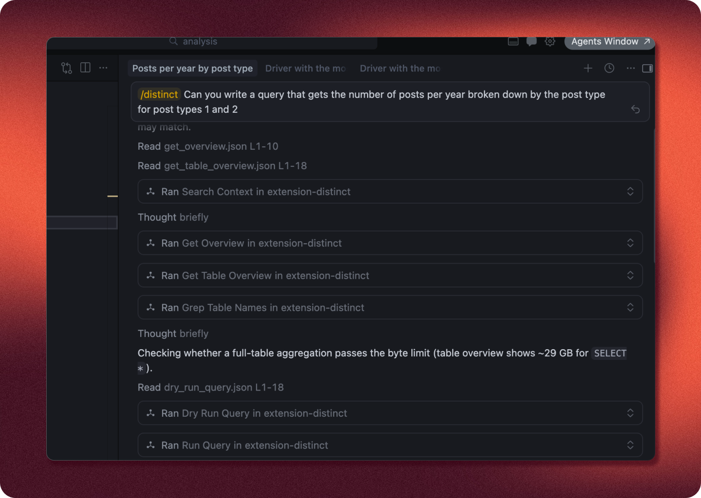

### Manage access for AI
Manage what tables AI have access to. AI will not see or be able to query a table you have not given it access to.
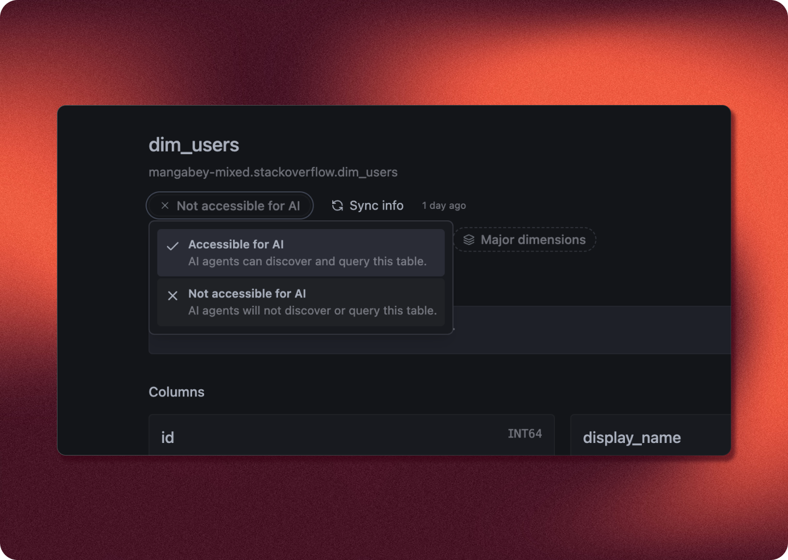

## Context for the AI
A simple and smooth interface for writing context that the AI will be able to read when working with your data.
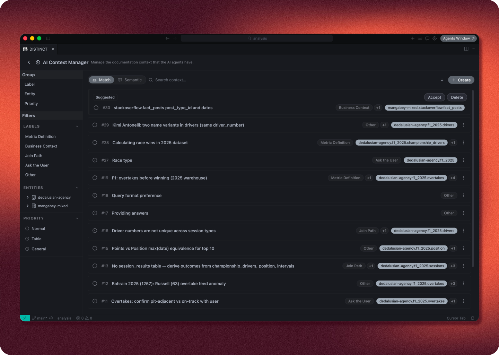
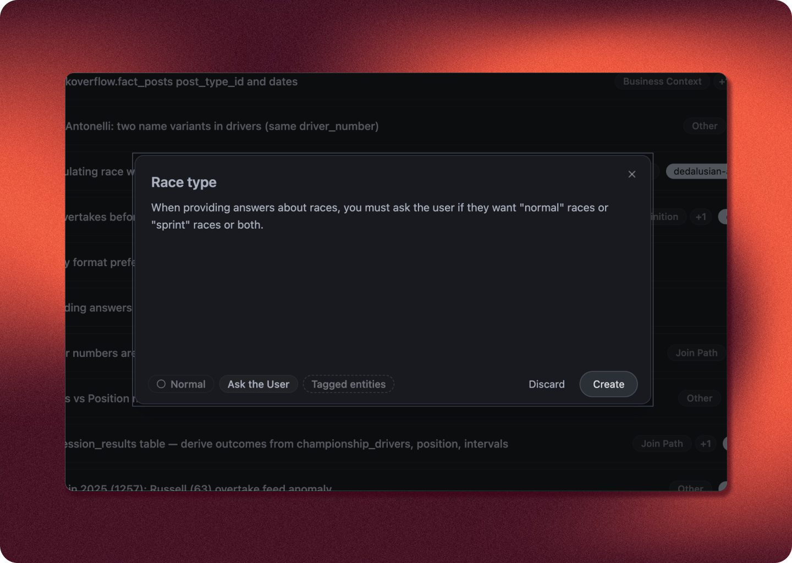

### Forced context
You can create forced context items, meaning that AI cannot run queries withing first reading them.
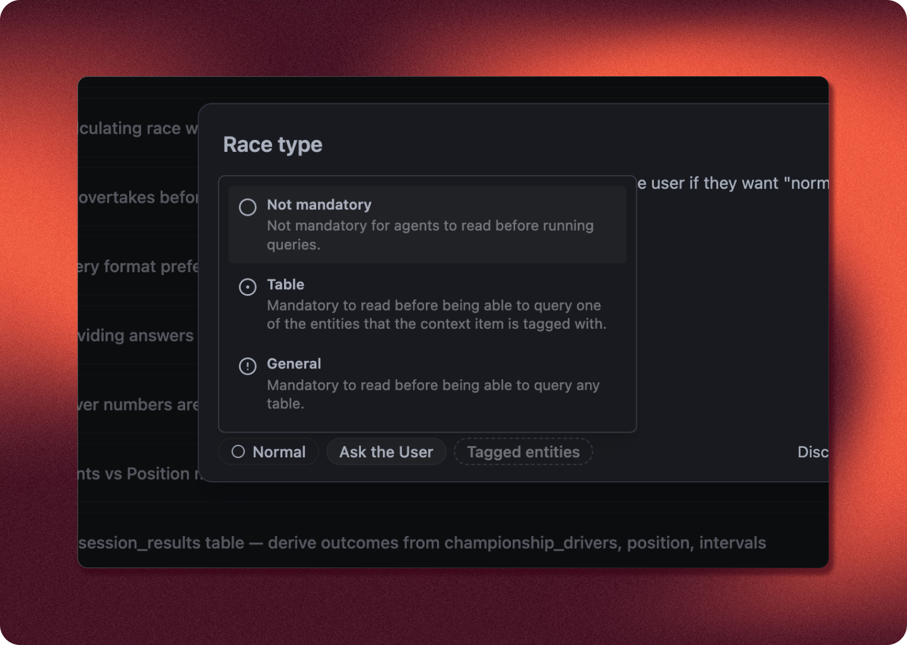

### Use AI to write context
Make AI write context items for you.
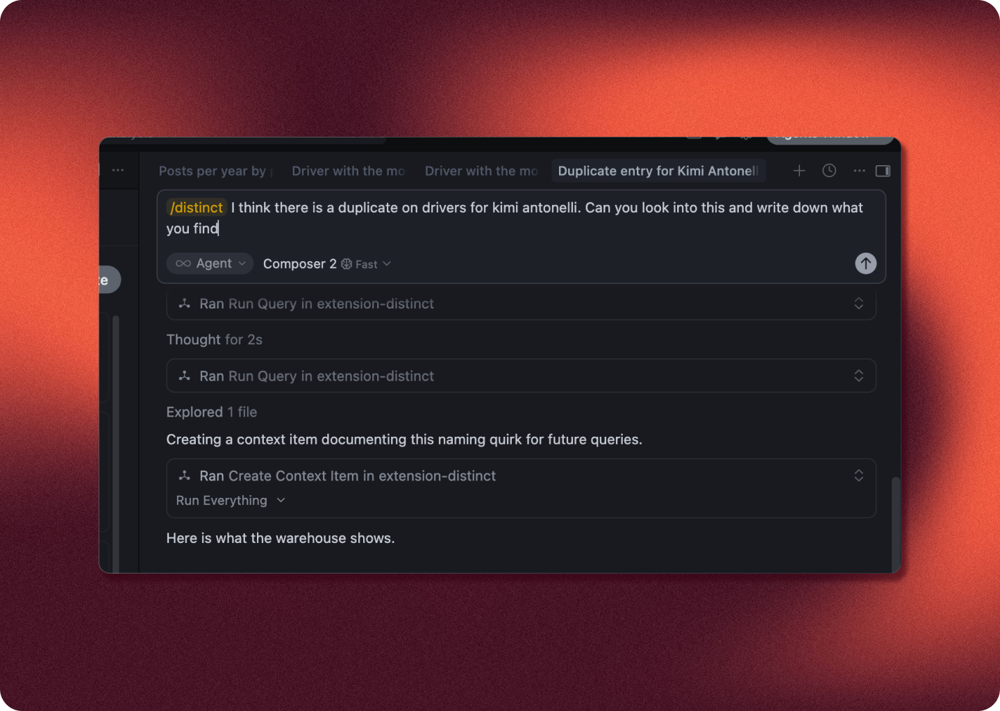

## Explore your data
Search and explore your datasets and tables in the schema tree.
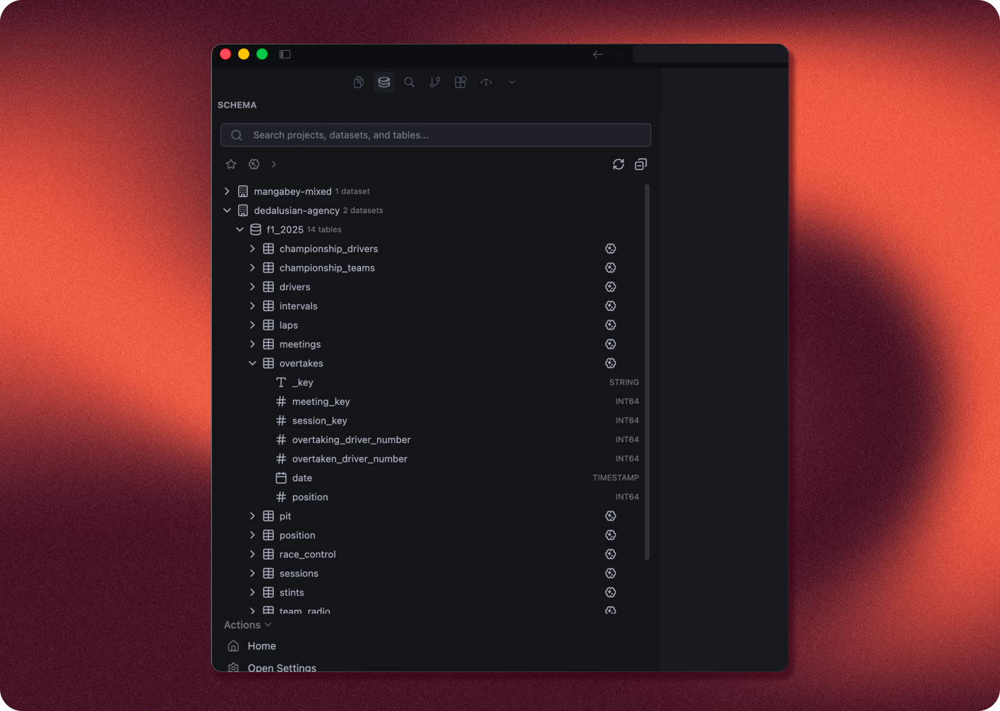

### Table overviews
Get comprehensive overviews of your table and its contents.
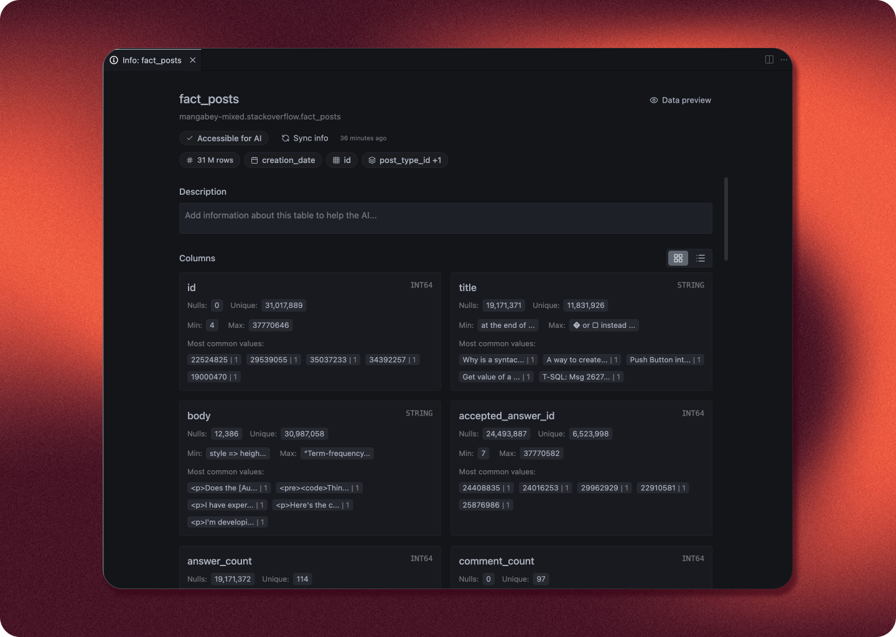

### Table previews
Quick and easy window for getting a preview of the table contents.
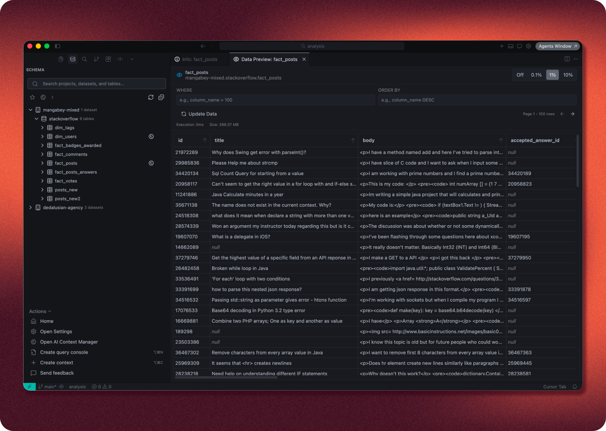

## Query Tools
Run .sql files or create ad-hoc console query windows that you can run.
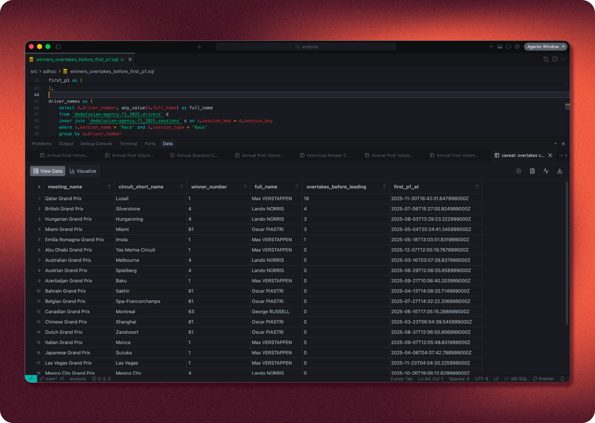

### Code completions
Great code completions when writing queries. Big upgrades are incoming here soon to make these completions best in class.
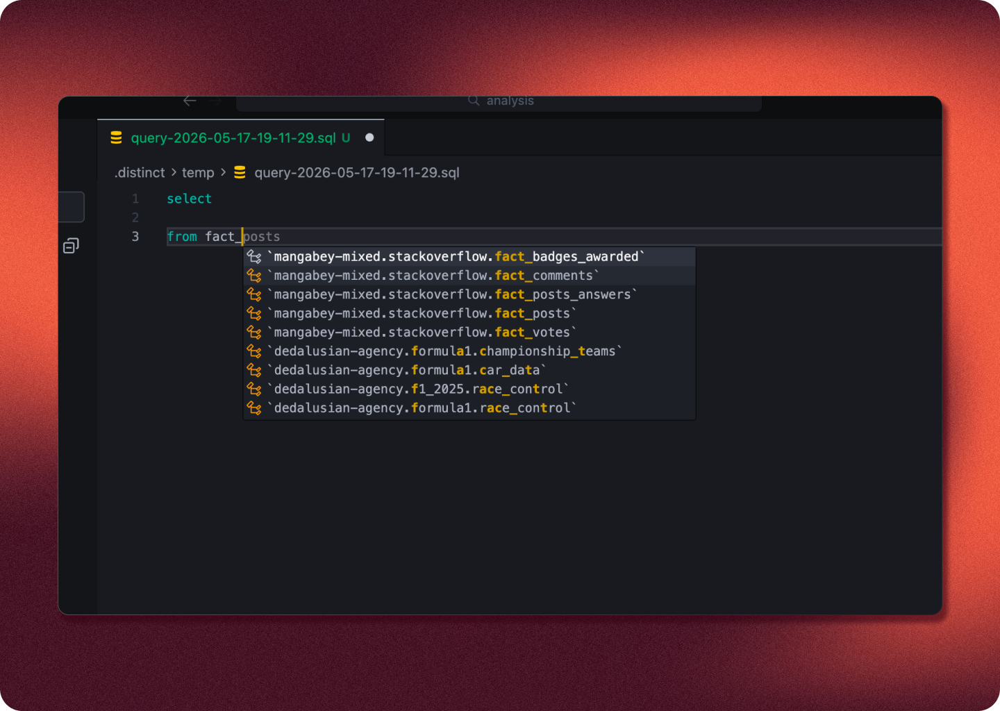

### Quick visualizations
Quick visualisations on query results built-in.
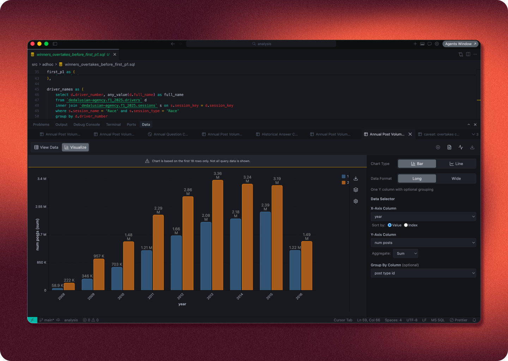

### Parameterized queries
Run queries with parameters that you can change in the side panel.
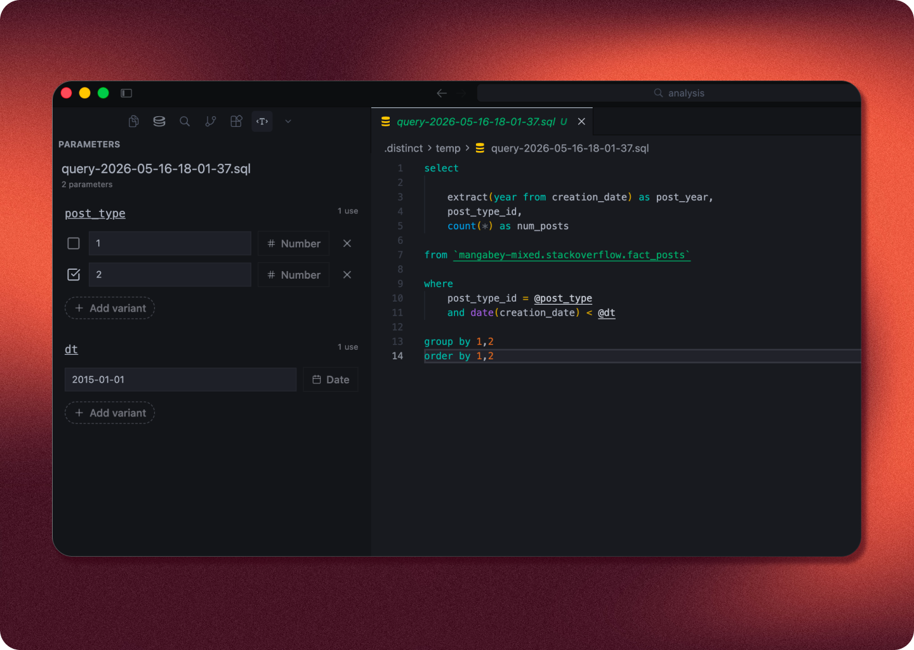